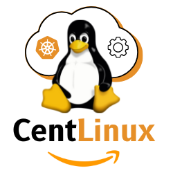

# 
Linux System Administration, DevOps, Docker, Kubernetes, AWS and Ansible Configurations

This repository contains code examples, configuration files, and scripts referenced in my blog [CentLinux](https://centlinux.com) posts.  
Each folder corresponds to a specific blog article and contains all related resources.

---

## 📚 How to Use This Repository
1. Browse the folders to find the code for the blog post you’re reading.
2. Click on the file name to view it.
3. For direct download, click the **"Raw"** button in GitHub and save the file.
4. Follow instructions in the post-specific README files for setup or usage.

---

